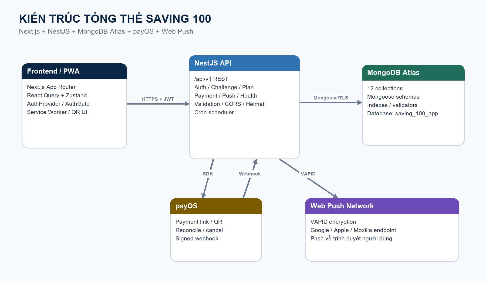
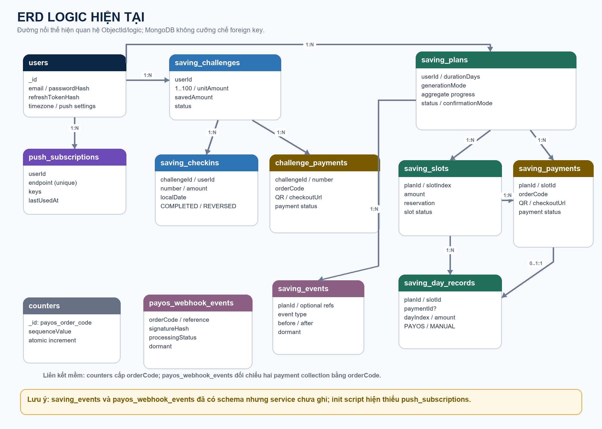

# TÀI LIỆU KỸ THUẬT HỆ THỐNG SAVING 100

**Phạm vi:** Hiện trạng hệ thống (as-is), mô hình dữ liệu, thiết kế UI, kiến trúc backend, đặc tả API, tích hợp payOS, Web Push và triển khai  
**Phiên bản tài liệu:** 1.0  
**Ngày rà soát:** 30/07/2026  
**Mốc source:** commit `764698d037af2297f3cc5177bcf4ee5557de987c` (`fix notification`)  
**Package manager chuẩn:** `pnpm@9.15.0`

> **Mục đích tài liệu.** Đây là hồ sơ kỹ thuật chuẩn hoá theo source code hiện tại. Nội dung phân biệt rõ phần đã hoạt động, phần mới chỉ có mô hình dữ liệu/cấu hình, và phần còn rủi ro hoặc chưa hoàn thiện. Tài liệu không chứa mật khẩu, JWT secret, khóa payOS hoặc khóa VAPID thực tế.

## Mục lục

1. Tổng quan hệ thống
2. Phạm vi chức năng hiện có
3. Kiến trúc tổng thể
4. Cấu trúc source và công nghệ
5. Thiết kế frontend và UI
6. Thiết kế backend
7. Mô hình dữ liệu và ERD
8. Quy tắc nghiệp vụ và vòng đời trạng thái
9. Đặc tả API REST
10. Xác thực, cookie và bảo mật
11. Tích hợp payOS
12. Web Push và lịch nhắc
13. Cấu hình môi trường và triển khai
14. Kiểm thử, chất lượng và vận hành
15. Sai lệch, rủi ro và lộ trình chuẩn hoá
16. Thuật ngữ và nguồn đối chiếu

# 1. Tổng quan hệ thống

Saving 100 là ứng dụng PWA mobile-first giúp người dùng lập và theo dõi các khoản tiết kiệm. Hệ thống hiện có hai miền nghiệp vụ chạy song song:

- **Thử thách mặc định 100 ô:** mỗi ô mang số từ 1 đến 100; số tiền bằng `số ô × 1.000 VND`; tổng mục tiêu mặc định là 5.050.000 VND.
- **Kế hoạch mở rộng:** người dùng tự tạo kế hoạch từ 30 đến 300 khoản, chọn cách sinh số tiền, ngày bắt đầu và cách xác nhận khoản tiết kiệm.

Người dùng có thể hoàn thành một khoản theo hai cách:

- **Tự tiết kiệm tiền mặt:** hệ thống ghi nhận thủ công, không giữ tiền.
- **Gửi vào quỹ qua QR payOS:** backend tạo payment link/QR, chỉ ghi nhận hoàn thành sau khi payOS xác nhận.

Các khả năng bổ sung:

- Đăng ký, đăng nhập, refresh phiên bằng JWT và cookie HttpOnly.
- Lịch sử và thống kê hợp nhất giữa thử thách mặc định và các kế hoạch mở rộng.
- Chọn kế hoạch ưu tiên trên lịch sử/thống kê.
- Quản lý và xóa kế hoạch mở rộng.
- PWA manifest và Web Push theo giờ nhắc riêng của từng tài khoản.
- Health check ứng dụng và MongoDB.
- Swagger UI tại `/docs`.

## 1.1 Đối tượng sử dụng

- Người dùng cá nhân muốn theo dõi thói quen tiết kiệm.
- Quản trị kỹ thuật triển khai frontend trên Vercel và API trên Render.
- Lập trình viên bảo trì Next.js, NestJS và MongoDB Atlas.

## 1.2 Nguyên tắc sản phẩm hiện tại

- Ứng dụng là công cụ theo dõi; không tự nhận giữ tiền.
- Dữ liệu của người dùng được phân tách bằng `userId`.
- Khoản thanh toán QR chỉ được coi là hoàn thành sau xác minh backend.
- Mọi API nghiệp vụ, trừ health, auth công khai và webhook payOS, đều yêu cầu access token.
- Kế hoạch mặc định 100 ô được tự tạo khi người dùng lần đầu mở bảng.

# 2. Phạm vi chức năng hiện có

## 2.1 Ma trận chức năng

| Nhóm | Chức năng | Trạng thái hiện tại |
|---|---|---|
| Tài khoản | Đăng ký bằng email, tên hiển thị, mật khẩu | Đã có |
| Tài khoản | Đăng nhập, refresh token, đăng xuất | Đã có |
| Tài khoản | Nhiều phiên/thiết bị độc lập | Chưa hoàn chỉnh; chỉ lưu một refresh token hash/user |
| Thử thách 100 ô | Tự tạo bảng mặc định | Đã có |
| Thử thách 100 ô | Tick tiền mặt, QR payOS, chọn ngẫu nhiên, hoàn tác | Đã có |
| Thử thách 100 ô | Một khoản hoàn thành mỗi ngày | Đã có ở code và unique index |
| Kế hoạch mở rộng | Tạo kế hoạch 30–300 khoản | Đã có |
| Kế hoạch mở rộng | Ba cách sinh danh sách khoản tiền | Đã có |
| Kế hoạch mở rộng | Tick tiền mặt hoặc QR payOS | Đã có, tùy `confirmationMode` |
| Kế hoạch mở rộng | Xóa kế hoạch | Đã có, xóa vật lý dữ liệu liên quan |
| Kế hoạch mở rộng | Tạm dừng, tiếp tục, lưu trữ | Có enum/schema nhưng chưa có API/UI đầy đủ |
| Hoàn thành | Chúc mừng và điều hướng sang tạo kế hoạch | Đã có ở UI |
| Lịch sử | Gộp thử thách mặc định và kế hoạch mở rộng | Đã có |
| Thống kê | Tổng quan và từng kế hoạch | Đã có |
| Ưu tiên | Chọn kế hoạch hiển thị trước | Đã có, lưu ở `localStorage` |
| Web Push | Bật/tắt theo thiết bị, gửi thử, chọn giờ | Đã có |
| PWA | Manifest và service worker | Đã có; chưa có cache/offline app shell |
| payOS | Tạo QR, reconcile, cancel, webhook | Đã có |
| Audit | Collection webhook event và saving event | Có schema; chưa được ghi dữ liệu trong service |

## 2.2 Ngoài phạm vi hiện tại

- Quản trị viên và phân quyền nhiều vai trò.
- Quên/đặt lại mật khẩu, xác minh email, đăng nhập mạng xã hội.
- Đồng bộ ngân hàng ngoài payOS.
- Ví nội bộ, sổ cái kế toán hoặc đối soát số dư quỹ.
- Push notification dựa trên việc người dùng đã tiết kiệm trong ngày hay chưa.
- Dashboard vận hành, log tập trung, cảnh báo và distributed tracing.
- Chế độ offline đầy đủ và đồng bộ lại khi có mạng.

# 3. Kiến trúc tổng thể



## 3.1 Kiểu kiến trúc

Hệ thống là monorepo gồm frontend, backend và package kiểu dữ liệu dùng chung:

- **Frontend:** Next.js App Router, render các route tĩnh rồi lấy dữ liệu từ REST API trên client.
- **Backend:** NestJS modular monolith, REST API dưới prefix `/api/v1`.
- **Database:** MongoDB Atlas qua Mongoose.
- **Thanh toán:** payOS Node SDK.
- **Thông báo:** Web Push với VAPID và service worker.

## 3.2 Luồng dữ liệu chính

1. Trình duyệt tải Next.js frontend.
2. `AuthProvider` gọi `/auth/refresh` bằng cookie HttpOnly để khôi phục phiên.
3. Frontend giữ access token trong bộ nhớ và gắn Bearer token vào API nghiệp vụ.
4. NestJS xác thực token, lấy `userId`, thực hiện nghiệp vụ và đọc/ghi MongoDB.
5. Khi tạo QR, backend gọi payOS và trả `checkoutUrl`/`qrCode`.
6. payOS gọi webhook về backend; backend cập nhật payment, slot/check-in, day record và tổng tiến độ.
7. Scheduler Web Push chạy mỗi phút, so giờ địa phương của user với giờ nhắc đã lưu và gửi qua endpoint trình duyệt.

## 3.3 Ranh giới tin cậy

| Ranh giới | Dữ liệu đi qua | Cơ chế bảo vệ hiện có |
|---|---|---|
| Trình duyệt ↔ Next.js | HTML, JS, CSS, service worker | HTTPS do nền tảng triển khai |
| Trình duyệt ↔ NestJS | JSON, Bearer token, refresh cookie | CORS, JWT, HttpOnly/Secure cookie, Helmet |
| NestJS ↔ MongoDB Atlas | Hồ sơ, kế hoạch, payment, subscription | MongoDB credentials/TLS trong URI |
| NestJS ↔ payOS | Payment request, trạng thái, webhook | API key, client ID, checksum/signature |
| NestJS ↔ Push service | Subscription và payload mã hóa | VAPID key pair, Web Push encryption |

# 4. Cấu trúc source và công nghệ

## 4.1 Cấu trúc monorepo

```text
D:\Saving
├─ apps
│  ├─ api                 NestJS API
│  │  ├─ src
│  │  │  ├─ auth
│  │  │  ├─ challenges
│  │  │  ├─ database
│  │  │  ├─ health
│  │  │  ├─ payments
│  │  │  ├─ push
│  │  │  └─ saving-plans
│  │  └─ test
│  └─ web                 Next.js frontend
│     ├─ app
│     ├─ components
│     ├─ lib
│     ├─ public
│     └─ stores
├─ packages
│  └─ shared              TypeScript types dùng chung
├─ init-saving-100-app.js Script validator/index MongoDB
├─ pnpm-workspace.yaml
└─ package.json
```

## 4.2 Công nghệ và phiên bản thực tế

| Lớp | Công nghệ | Phiên bản đã cài |
|---|---|---|
| Runtime/package | pnpm | 9.15.0 |
| Frontend | Next.js | 15.5.22 |
| UI | React / React DOM | 19.2.8 |
| Server state | TanStack React Query | 5.101.4 |
| Client state | Zustand | 5.0.14 |
| Icon/QR | Lucide React / qrcode.react | 0.511.0 / 4.2.0 |
| Backend | NestJS core/common | 11.1.28 |
| ODM | Mongoose | 8.24.1 |
| Auth | jsonwebtoken / argon2 | 9.0.3 / 0.41.1 |
| Payment | `@payos/node` | 2.0.5 |
| Push | `web-push` | 3.6.7 |
| Test | Jest | 29.7.0 |
| Ngôn ngữ | TypeScript | 5.9.3 |

## 4.3 Script vận hành

| Lệnh | Tác dụng |
|---|---|
| `pnpm install` | Cài dependency toàn workspace |
| `pnpm dev` | Chạy đồng thời web cổng 3000 và API cổng 4000 |
| `pnpm build` | Build shared, API và web |
| `pnpm lint` | Chạy ESLint cho API và web |
| `pnpm typecheck` | Type-check toàn workspace |
| `pnpm test` | Chạy test Jest của API |

# 5. Thiết kế frontend và UI

## 5.1 Nguyên tắc thiết kế

- Mobile-first, chiều rộng tối thiểu 320 px.
- Trên màn hình từ 768 px, toàn bộ app được đặt trong khung tối đa 520 px.
- Font chính Manrope, trọng lượng 500–800.
- Giao diện hiện tại dùng lớp override đơn sắc: nền trắng/xám nhạt, chữ đen, đường viền `#e5e5e2`.
- Góc bo lớn 15–32 px, nút hành động dạng pill, bottom sheet cho lựa chọn và thanh toán.
- Bảng tiết kiệm có 5 cột trên mobile và 10 cột trên màn hình từ 768 px.
- Bottom navigation cố định có 5 mục: Bảng ô, Kế hoạch, Lịch sử, Thống kê, Cá nhân.
- Toast/notice cố định phía trên bottom navigation, `z-index: 140`, tự ẩn sau 7,5 giây.
- Bottom sheet/payment sheet dùng `z-index: 100`, có giới hạn chiều cao và cuộn dọc.

## 5.2 Design token thực tế

| Token | Giá trị hiệu lực |
|---|---|
| `--background` | `#f5f5f3` |
| `--surface` | `#ffffff` |
| `--surface-soft` | `#f7f7f5` |
| `--text` | `#111111` |
| `--muted` | `#666666` |
| `--faint` | `#888888` |
| `--border` | `#e5e5e2` |
| `--primary-gradient` | `linear-gradient(100deg, #111, #333)` |
| App max width desktop | 520 px |
| Bottom nav max width | 520 px |
| Content board columns | 5 mobile / 10 desktop |

> File CSS vẫn giữ token màu xanh–tím ban đầu nhưng một khối `:root` phía sau ghi đè toàn bộ thành hệ đơn sắc. Vì vậy hệ màu hiệu lực là đen–trắng, còn một số màu xanh/tím hard-code vẫn xuất hiện ở vài nền phụ.

## 5.3 Kiến trúc trạng thái frontend

| Loại trạng thái | Công cụ | Dữ liệu |
|---|---|---|
| Auth toàn ứng dụng | React Context | user, access token, loading, login/register/logout |
| Server cache | React Query | challenge, plans, history, statistics |
| Tương tác bảng mặc định | Zustand | ô đang chọn, ô gợi ý, trạng thái mở sheet |
| Tạm thời theo component | `useState` | payment, notice, form, loading |
| Ưu tiên kế hoạch | `localStorage` | `saving-analytics-priority:{userId}` |

## 5.4 Danh mục route và màn hình

| Route | Màn hình | Nội dung chính |
|---|---|---|
| `/login` | Đăng nhập/đăng ký | Email, tên hiển thị, mật khẩu |
| `/` | Trang chính | Tổng đã tiết kiệm, tiến độ, bảng 100 ô, hành động nhanh, giao dịch gần nhất |
| `/plan` | Kế hoạch mở rộng | Tổng quan, tiến độ, bảng ô theo số ngày, QR/tick tiền mặt |
| `/plan/new` | Tạo kế hoạch | Số ngày, ngày bắt đầu, cách sinh tiền, preview, cách xác nhận |
| `/plan/manage` | Quản lý kế hoạch | Danh sách, trạng thái, tiến độ, mở hoặc xóa |
| `/history` | Lịch sử | Gộp mọi khoản đã hoàn thành từ tất cả kế hoạch |
| `/stats` | Thống kê | Kế hoạch ưu tiên, tổng hợp và chi tiết từng kế hoạch |
| `/profile` | Cá nhân | Hồ sơ, quản lý kế hoạch, Web Push, đăng xuất |
| `/payment/return` | Quay lại từ payOS | Thông báo đang xác minh, liên kết quay lại kế hoạch |

## 5.5 Bảng mặc định 100 ô

- Tự tải bằng `GET /challenges/current`.
- Mỗi ô hiển thị số thứ tự nhỏ và số tiền rút gọn theo nghìn đồng.
- Ô hoàn thành hiển thị dấu check; ô ngẫu nhiên có trạng thái gợi ý.
- Khi chọn ô, `ConfirmSheet` hiển thị số tiền đầy đủ và hai lựa chọn:
  - tự tiết kiệm tiền mặt;
  - gửi vào quỹ qua QR.
- QR được hiển thị trong `ChallengePaymentSheet`.
- Có hành động kiểm tra thanh toán, sao chép link và hủy payment.
- Manual check-in có thể hoàn tác bằng endpoint reverse.
- Khi hoàn thành 100%, UI chúc mừng và sau 2,2 giây chuyển sang `/plan/new`.

## 5.6 Kế hoạch mở rộng 30–300 ô

Form tạo kế hoạch gồm:

- Tên kế hoạch.
- Số ngày với preset 30, 50, 100, 120, 300 và input tùy chỉnh.
- Ngày bắt đầu không được ở quá khứ.
- Ba cách sinh khoản tiền, mỗi cách có nút `(i)` giải thích.
- Preview do backend tính, debounce 250 ms.
- Quy tắc xác nhận: chỉ payOS hoặc payOS/thủ công.
- Thời hạn QR: 10, 15 hoặc 30 phút.

Bảng kế hoạch:

- Sắp xếp theo `slotIndex`, không theo số tiền.
- Mỗi ô hiển thị `slotIndex` và số tiền rút gọn.
- Trạng thái: available, reserved, paid/manually completed.
- Kế hoạch `SCHEDULED` chưa cho chọn ô.
- Có link đổi kế hoạch và quản lý kế hoạch.
- Khi 100% hoàn thành, UI chúc mừng và chuyển sang tạo kế hoạch.

## 5.7 Lịch sử, thống kê và ưu tiên

- Frontend tải challenge mặc định, lịch sử, thống kê, danh sách kế hoạch và dữ liệu từng kế hoạch.
- Dữ liệu được hợp nhất ở client trong `loadSavingAnalytics`.
- Kế hoạch ưu tiên chỉ là lựa chọn trình bày trên thiết bị hiện tại; không lưu vào MongoDB.
- Thống kê tổng cộng cộng mục tiêu, số tiền và số khoản của tất cả kế hoạch.
- Chuỗi ngày của kế hoạch mở rộng được tính từ `localCompletedDate` trên frontend.

## 5.8 PWA và khả năng truy cập

Đã có:

- `manifest.webmanifest`, `display: standalone`, icon SVG.
- `viewport-fit=cover` và safe-area cho thiết bị có tai thỏ.
- Nhiều `aria-label`, `role="dialog"`, `role="status"`, `aria-modal`.
- Service worker nhận Web Push.

Chưa có hoặc chưa đầy đủ:

- Cache strategy/offline fallback.
- Focus trap trong bottom sheet, đóng bằng Escape và khôi phục focus.
- Skip link, kiểm thử bàn phím và kiểm thử screen reader.
- Hướng dẫn riêng cho iOS yêu cầu cài PWA ra Home Screen trước khi bật push.

# 6. Thiết kế backend

## 6.1 Module NestJS

| Module | Trách nhiệm |
|---|---|
| `DatabaseModule` | Kết nối MongoDB, đăng ký 12 Mongoose model |
| `AuthModule` | Đăng ký, đăng nhập, JWT, refresh, logout |
| `ChallengesModule` | Thử thách mặc định 100 ô, check-in, thống kê |
| `SavingPlansModule` | Kế hoạch mở rộng, sinh amount, slot, hoàn thành thủ công |
| `PaymentsModule` | Payment cho challenge và saving plan |
| `PayosModule` | SDK payOS, webhook, mapping trạng thái |
| `PushModule` | Subscription, giờ nhắc, test push, cron scheduler |
| Health controllers | Kiểm tra process và MongoDB |

## 6.2 Middleware và cross-cutting concern

- Prefix toàn cục: `/api/v1`, ngoại trừ `/health`.
- Helmet thiết lập security headers.
- Cookie parser đọc `refresh_token`.
- CORS bật credentials và whitelist từ `WEB_ORIGIN`; hỗ trợ danh sách phân tách dấu phẩy.
- ValidationPipe: `whitelist`, `transform`, `forbidNonWhitelisted`.
- Throttler toàn cục: 60 request/60 giây.
- Swagger: `/docs`, có Bearer auth ở mức tài liệu.
- Schedule module chạy cron Web Push.

## 6.3 Mẫu response

Response thành công nghiệp vụ:

```json
{
  "success": true,
  "data": {}
}
```

Lỗi chủ động bằng `ApiError`:

```json
{
  "success": false,
  "error": {
    "code": "PLAN_NOT_FOUND",
    "message": "Không tìm thấy kế hoạch.",
    "details": null
  }
}
```

Ngoại lệ:

- `GET /api/v1/health/database` trả object không bọc `success/data`.
- `UnauthorizedException`, validation error và lỗi không được bắt có thể dùng response mặc định của NestJS, chưa đồng nhất với `ApiError`.

## 6.4 Tầng lưu trữ hiện tại

Backend không hoàn toàn dùng MongoDB làm nguồn đọc trực tiếp:

- `ChallengesService` tải toàn bộ challenge/check-in vào `Map` khi khởi động, sau đó đọc/ghi trên bộ nhớ và gọi persist bất đồng bộ.
- `SavingPlansStore` tải toàn bộ plan/slot/payment/day record vào `Map`, sau đó dùng cache bộ nhớ làm nguồn nghiệp vụ.
- `ChallengePaymentsService`, `PushService` và `AuthService` thao tác Mongoose trực tiếp.

Hệ quả:

- Một process chạy đơn lẻ có thể hoạt động.
- Nhiều replica không chia sẻ cache và có thể xử lý dữ liệu không nhất quán.
- Ghi kiểu `void persist...` không chờ MongoDB hoàn tất; API có thể trả thành công trước khi dữ liệu được lưu bền vững.
- Khởi động lại ngay sau thao tác có nguy cơ mất thay đổi chưa persist.
- Không phù hợp để scale ngang nếu chưa thay cache bằng repository MongoDB/transaction.

# 7. Mô hình dữ liệu và ERD

## 7.1 ERD logic hiện tại



MongoDB không cưỡng chế foreign key. Các quan hệ dưới đây là quan hệ logic bằng `ObjectId`, được service kiểm tra quyền sở hữu và tính nhất quán.

## 7.2 Cardinality

| Nguồn | Quan hệ | Đích | Diễn giải |
|---|---|---|---|
| User | 1 — N | PushSubscription | Một user có nhiều thiết bị/browser |
| User | 1 — N | Challenge | Có thể có nhiều challenge; UI mặc định dùng challenge active |
| Challenge | 1 — N | Checkin | Mỗi lần tick/reverse là một check-in |
| Challenge | 1 — N | ChallengePayment | Một ô có thể có nhiều payment đã hủy/hết hạn, tối đa một payment active |
| User | 1 — N | SavingPlan | Kế hoạch mở rộng |
| SavingPlan | 1 — N | SavingSlot | Số slot bằng `durationDays` |
| SavingPlan | 1 — N | SavingPayment | Payment QR của kế hoạch |
| SavingSlot | 1 — N | SavingPayment | Có thể có lịch sử payment thất bại/hủy; chỉ một active hoặc paid |
| SavingPlan | 1 — N | SavingDayRecord | Bản ghi hoàn thành |
| SavingSlot | 1 — N | SavingDayRecord | Quan hệ logic; active record nên là một |
| SavingPayment | 0..1 — 1 | SavingDayRecord | Payment thành công sinh day record |
| SavingPlan | 1 — N | SavingEvent | Audit model dự kiến, hiện chưa ghi |
| Counter | 1 | orderCode sequence | Bộ đếm atomic dùng chung |
| PayosWebhookEvent | N — 0..1 | Payment qua orderCode | Quan hệ mềm, chưa được service sử dụng |

## 7.3 Quy ước chung

Tất cả collection dùng Mongoose timestamps, trừ việc `counters` được khởi tạo trực tiếp bằng script:

| Trường | Kiểu | Ý nghĩa |
|---|---|---|
| `_id` | ObjectId hoặc String | Khoá chính |
| `createdAt` | Date | Thời điểm tạo |
| `updatedAt` | Date | Thời điểm cập nhật |
| `__v` | Number | Version key Mongoose, không có ở counter do script |

## 7.4 Collection `users`

| Trường | Kiểu | Ràng buộc/default | Ý nghĩa |
|---|---|---|---|
| `email` | String | required, lowercase, unique, 5–254 | Email đăng nhập |
| `passwordHash` | String | required, 20–512 | Argon2 hash |
| `displayName` | String | required, 2–80 | Tên hiển thị |
| `avatarUrl` | String/null | default null | Ảnh đại diện, UI chưa sửa |
| `timezone` | String | default `Asia/Ho_Chi_Minh` | Múi giờ tài khoản |
| `currency` | Enum | `VND` | Tiền tệ |
| `refreshTokenHash` | String/null | default null | Hash refresh token hiện hành |
| `pushReminderEnabled` | Boolean | default false | Bật nhắc push |
| `pushReminderTime` | String `HH:mm` | default `15:00` | Giờ nhắc riêng |
| `status` | Enum | `ACTIVE`, `DISABLED`; default ACTIVE | Trạng thái tài khoản |

Indexes:

- `uq_users_email` unique trên `email`.
- `idx_users_status_createdAt` trên `status, createdAt desc`.

## 7.5 Collection `push_subscriptions`

| Trường | Kiểu | Ràng buộc/default | Ý nghĩa |
|---|---|---|---|
| `userId` | ObjectId | required | Chủ subscription |
| `endpoint` | String | required, unique, max 2048 | Endpoint Google/Apple/Mozilla |
| `keys.p256dh` | String | required logic | Public encryption key |
| `keys.auth` | String | required logic | Authentication secret |
| `expirationTime` | Number/null | default null | Expiration do browser cung cấp |
| `userAgent` | String/null | max 512 | Dấu vết thiết bị |
| `lastUsedAt` | Date/null | default null | Lần gửi thành công gần nhất |

Indexes:

- `uq_push_subscriptions_endpoint` unique trên `endpoint`.
- `idx_push_subscriptions_user_createdAt` trên `userId, createdAt desc`.

## 7.6 Collection `saving_challenges`

| Trường | Kiểu | Ràng buộc/default | Ý nghĩa |
|---|---|---|---|
| `userId` | ObjectId | required | Chủ challenge |
| `name` | String | required | Tên challenge |
| `minNumber` | Number | default 1 | Số ô nhỏ nhất |
| `maxNumber` | Number | default 100 | Số ô lớn nhất |
| `unitAmount` | Number | default 1000 | Đơn vị nhân |
| `targetAmount` | Number | required | Tổng mục tiêu |
| `savedAmount` | Number | default 0 | Tổng đã tiết kiệm, dữ liệu tổng hợp |
| `completedCells` | Number | default 0 | Số ô hoàn thành, dữ liệu tổng hợp |
| `mode` | Enum | `ONE_PER_DAY`, `FLEXIBLE`; default ONE_PER_DAY | Chế độ tiến độ |
| `selectionMode` | String | default FREE | Cách chọn ô |
| `startDate` | Date | required | Ngày bắt đầu |
| `completedAt` | Date/null | default null | Thời điểm hoàn thành |
| `status` | Enum | ACTIVE, COMPLETED, ARCHIVED | Trạng thái |

Indexes:

- `userId, status`.
- `userId, createdAt desc`.

## 7.7 Collection `saving_checkins`

| Trường | Kiểu | Ràng buộc/default | Ý nghĩa |
|---|---|---|---|
| `challengeId` | ObjectId | required | Challenge |
| `userId` | ObjectId | required | Chủ dữ liệu |
| `number` | Integer | 1–100 | Số ô |
| `amount` | Integer | > 0 | Số tiền |
| `localDate` | String | `YYYY-MM-DD` | Ngày địa phương |
| `timezone` | String | required | Múi giờ lúc ghi |
| `idempotencyKey` | String | required | Chống gửi lặp |
| `status` | Enum | COMPLETED/REVERSED | Trạng thái |
| `reversedAt` | Date/null | default null | Lúc hoàn tác |
| `reverseReason` | String/null | default null | Lý do, hiện chưa nhập từ UI |

Indexes:

- Unique partial `challengeId, number` khi `status=COMPLETED`.
- Unique partial `challengeId, localDate` khi `status=COMPLETED`.
- Unique `userId, idempotencyKey`.
- `challengeId, createdAt desc`.

## 7.8 Collection `challenge_payments`

| Nhóm trường | Trường chính | Ý nghĩa |
|---|---|---|
| Sở hữu | `userId`, `challengeId`, `number` | User, challenge và ô |
| Provider | `provider=PAYOS`, `orderCode`, `paymentLinkId` | Định danh payOS |
| Giá trị | `amount`, `currency=VND`, `description` | Nội dung payment |
| Trình bày | `checkoutUrl`, `qrCode` | Link/QR cho frontend |
| Trạng thái | `CREATING/PENDING/PROCESSING/PAID/CANCELLED/EXPIRED/FAILED` | Vòng đời |
| An toàn | `idempotencyKey`, `expiresAt` | Chống lặp và hết hạn |
| Kết quả | `paidAt`, `cancelledAt`, `lastReconciledAt` | Mốc xử lý |
| Đối soát | `providerReference`, `transactionDateTime` | Tham chiếu payOS |
| Lỗi | `errorCode`, `errorMessage` | Lỗi tạo/xử lý |

Indexes:

- Unique `orderCode`.
- Unique sparse `paymentLinkId`.
- Unique `userId, idempotencyKey`.
- `challengeId, number, status`.
- Unique partial `challengeId, number` cho trạng thái active.
- `expiresAt, status`.

## 7.9 Collection `saving_plans`

| Trường | Kiểu | Ràng buộc/default | Ý nghĩa |
|---|---|---|---|
| `userId` | ObjectId | required | Chủ kế hoạch |
| `name` | String | 2–80 | Tên |
| `durationDays` | Integer | 30–300 | Số khoản |
| `currentDayIndex` | Integer | 1–300, default 1 | Thứ tự khoản hiện tại |
| `completedDays` | Integer | 0–300 | Số khoản hoàn thành |
| `generationMode` | Enum | 3 mode | Cách sinh amount |
| `targetAmount` | Integer | > 0 | Tổng mục tiêu |
| `totalSavedAmount` | Integer | default 0 | Tổng đã tiết kiệm, aggregate |
| `remainingAmount` | Integer | >= 0 | Còn lại, aggregate |
| `unitAmount` | Number/null | >= 0 | Đơn vị classic |
| `minAmount` | Number/null | >= 0 | Khoản thấp nhất |
| `maxAmount` | Number/null | >= 0 | Khoản cao nhất |
| `stepAmount` | Number/null | >= 0 | Bước làm tròn |
| `progressMode` | Enum | FLEXIBLE/CALENDAR | Chế độ tiến độ |
| `confirmationMode` | Enum | PAYOS_ONLY/PAYOS_OR_MANUAL | Cách xác nhận |
| `paymentDestinationMode` | Enum | SINGLE_OWNER/PLATFORM | Kênh nhận tiền |
| `paymentExpiresInMinutes` | Integer | 1–1440 | Hạn QR |
| `timezone` | String | default Asia/Ho_Chi_Minh | Múi giờ |
| `startDate` | Date | required | Ngày bắt đầu |
| `status` | Enum | DRAFT/SCHEDULED/ACTIVE/PAUSED/COMPLETED/ARCHIVED | Trạng thái |
| `activatedAt` | Date/null | default null | Lúc kích hoạt |
| `completedAt` | Date/null | default null | Lúc hoàn thành |

Indexes:

- `idx_saving_plans_user_status`.
- `idx_saving_plans_user_createdAt`.
- `idx_saving_plans_status_startDate`.

## 7.10 Collection `saving_slots`

| Trường | Kiểu | Ràng buộc/default | Ý nghĩa |
|---|---|---|---|
| `userId` | ObjectId | required | Chủ dữ liệu |
| `planId` | ObjectId | required | Kế hoạch |
| `slotIndex` | Integer | 1–300 | Thứ tự ô |
| `amount` | Integer | > 0 | Số tiền |
| `status` | Enum | AVAILABLE/RESERVED/PAID/MANUALLY_COMPLETED | Trạng thái |
| `reservedByPaymentId` | ObjectId/null | default null | Payment đang giữ ô |
| `reservationExpiresAt` | Date/null | default null | Hết hạn giữ |
| `assignedDayIndex` | Integer/null | 1–300 | Lượt hoàn thành được gán |
| `paidPaymentId` | ObjectId/null | default null | Payment thành công |
| `completedAt` | Date/null | default null | Lúc hoàn thành |

Indexes:

- Unique `planId, slotIndex`.
- `planId, status, amount`.
- `userId, planId, status`.
- Unique partial `planId, assignedDayIndex` khi có số.
- `reservationExpiresAt, status`.

## 7.11 Collection `saving_payments`

| Nhóm trường | Trường chính | Ý nghĩa |
|---|---|---|
| Sở hữu | `userId`, `planId`, `slotId`, `dayIndex` | User, kế hoạch, slot, lượt |
| Provider | `provider`, `orderCode`, `paymentLinkId` | Định danh payOS |
| Giá trị | `amount`, `currency`, `description` | Giá trị giao dịch |
| Trình bày | `checkoutUrl`, `qrCode` | Link/QR |
| Trạng thái | `status`, `expiresAt` | Vòng đời |
| An toàn | `idempotencyKey` | Chống request lặp |
| Kết quả | `paidAt`, `cancelledAt`, `failedAt`, `lastReconciledAt` | Mốc xử lý |
| Đối soát | `providerReference`, `transactionDateTime` | Dữ liệu provider |
| Lỗi | `errorCode`, `errorMessage` | Lỗi |

Indexes:

- Unique `orderCode`.
- Unique sparse `paymentLinkId`.
- Unique `userId, idempotencyKey`.
- `planId, status, createdAt desc`.
- `slotId, status`.
- `expiresAt, status`.
- Unique partial `planId, dayIndex` cho payment active.
- Unique partial `slotId` cho payment active hoặc PAID.

## 7.12 Collection `saving_day_records`

| Trường | Kiểu | Ràng buộc/default | Ý nghĩa |
|---|---|---|---|
| `userId` | ObjectId | required | Chủ dữ liệu |
| `planId` | ObjectId | required | Kế hoạch |
| `slotId` | ObjectId | required | Slot |
| `paymentId` | ObjectId/null | null nếu thủ công | Payment |
| `dayIndex` | Integer | 1–300 | Lượt hoàn thành |
| `amount` | Integer | > 0 | Số tiền |
| `confirmationSource` | Enum | PAYOS/MANUAL | Nguồn xác nhận |
| `status` | Enum | COMPLETED/REVERSED | Trạng thái |
| `localCompletedDate` | String | `YYYY-MM-DD` | Ngày địa phương |
| `completedAt` | Date | required | Thời điểm hoàn thành |
| `reversedAt` | Date/null | default null | Lúc hoàn tác |
| `reverseReason` | String/null | default null | Lý do |

Indexes:

- Unique partial `planId, dayIndex` khi COMPLETED.
- `planId, slotId`.
- `userId, planId, completedAt desc`.

## 7.13 Collection `payos_webhook_events`

| Trường | Kiểu | Ý nghĩa |
|---|---|---|
| `orderCode` | Number/null | Order liên quan |
| `paymentLinkId` | String/null | Payment link |
| `providerReference` | String/null | Reference payOS |
| `signatureHash` | String | Dấu vết chống lặp |
| `verified` | Boolean | Kết quả xác minh |
| `processingStatus` | Enum | RECEIVED/PROCESSED/IGNORED_DUPLICATE/FAILED |
| `errorMessage` | String/null | Lỗi |
| `receivedAt` | Date | Lúc nhận |
| `processedAt` | Date/null | Lúc xử lý xong |

Schema và index đã có, nhưng controller/service hiện chưa tạo document trong collection này.

## 7.14 Collection `saving_events`

Audit event dự kiến chứa `userId`, `planId`, các tham chiếu optional `slotId`, `paymentId`, `dayRecordId`, loại event, snapshot trước/sau và metadata.

Các loại event đã định nghĩa:

- PLAN_CREATED, PLAN_STARTED, PLAN_PAUSED, PLAN_RESUMED, PLAN_COMPLETED, PLAN_ARCHIVED.
- SLOT_RESERVED, SLOT_RELEASED.
- PAYMENT_CREATED, PAYMENT_PAID, PAYMENT_CANCELLED, PAYMENT_EXPIRED, PAYMENT_FAILED.
- MANUAL_COMPLETION_CREATED, DAY_RECORD_REVERSED.

Schema và index đã có, nhưng service hiện chưa ghi audit event.

## 7.15 Collection `counters`

| Trường | Kiểu | Ý nghĩa |
|---|---|---|
| `_id` | String | `payos_order_code` |
| `sequenceValue` | Integer | Số sequence hiện tại |
| `createdAt` | Date | Lúc tạo |
| `updatedAt` | Date | Lúc tăng gần nhất |

`findOneAndUpdate` với aggregation pipeline được dùng để tăng atomic.

## 7.16 Mức chuẩn hoá dữ liệu

Mô hình là chuẩn hoá theo nghiệp vụ nhưng có denormalization có chủ đích:

- `savedAmount`, `completedCells`, `totalSavedAmount`, `remainingAmount`, `completedDays` là aggregate để đọc nhanh.
- `userId` lặp trên slot/payment/day record để kiểm tra quyền và query nhanh.
- `amount` được chụp lại trên payment/day record nhằm giữ lịch sử dù slot thay đổi.

Các aggregate phải luôn cập nhật cùng transaction với record nguồn. Hiện tại chưa dùng MongoDB transaction nên có nguy cơ lệch nếu một trong nhiều lệnh ghi thất bại.

## 7.17 Chênh lệch giữa Mongoose schema và script MongoDB

| Hạng mục | Mongoose hiện tại | `init-saving-100-app.js` | Đánh giá |
|---|---|---|---|
| Số collection | 12 | 11 | Script thiếu `push_subscriptions` |
| User push fields | Có `pushReminderEnabled`, `pushReminderTime` | Chưa có validator | Chưa đồng bộ |
| Push indexes | Có khai báo | Không tạo | `autoIndex=false`, cần bổ sung script |
| Các collection khác | Có | Có | Phần lớn khớp |
| Index name challenge/check-in | Tên `idx/uq...` trong schema | Một số tên dạng key tự nhiên | Không ảnh hưởng key nhưng khó audit |
| Audit collections | Có schema | Có validator | Chưa được service sử dụng |

Do `autoIndex: false`, script khởi tạo là lớp cưỡng chế vật lý quan trọng. Nếu chưa cập nhật script, MongoDB Atlas có thể không có validator/index cho Web Push dù code chạy.

# 8. Quy tắc nghiệp vụ và vòng đời trạng thái

## 8.1 Thử thách mặc định

- Số ô: 100.
- Công thức: `amount = number × 1.000`.
- Tổng: `1.000 × (1 + 2 + … + 100) = 5.050.000 VND`.
- Một ô chỉ có một check-in COMPLETED.
- Một challenge chỉ có một check-in COMPLETED cho mỗi `localDate`.
- Cùng idempotency key trả lại kết quả hiện hành; key khác cho ô đã xong trả 409.
- Khi đạt 100 ô, challenge chuyển COMPLETED.
- Reverse giảm aggregate và có thể đưa challenge từ COMPLETED về ACTIVE.

## 8.2 Cách sinh khoản tiền kế hoạch mở rộng

| Mode | Input | Thuật toán |
|---|---|---|
| `CLASSIC_SEQUENCE` | `durationDays`, `unitAmount` | `[1×unit, 2×unit, …, n×unit]` |
| `TARGET_AUTO_DISTRIBUTION` | target, min, max, step | Khởi tạo mọi khoản bằng min, sau đó cộng step từ đầu danh sách đến khi đủ target |
| `CUSTOM_LIST` | Mảng amount | Số phần tử phải đúng bằng duration, mọi amount là số nguyên dương |

Ràng buộc auto distribution:

- `min ≤ max`.
- min, max và target phải chia hết cho step.
- `duration × min ≤ target ≤ duration × max`.

Thuật toán hiện tại dồn phần tăng vào các slot đầu nên danh sách có xu hướng cao ở đầu, không ngẫu nhiên và không cân bằng xen kẽ.

## 8.3 Trạng thái kế hoạch

```text
Tạo với startDate hôm nay   -> ACTIVE
Tạo với startDate tương lai -> SCHEDULED
SCHEDULED đến ngày bắt đầu  -> ACTIVE (khi kế hoạch được đọc)
ACTIVE đủ số khoản          -> COMPLETED
COMPLETED                   -> UI chúc mừng, không cho hoàn thành thêm
Bất kỳ kế hoạch hợp lệ      -> DELETE vật lý nếu không có payment active
```

`DRAFT`, `PAUSED`, `ARCHIVED` có trong type/schema nhưng chưa có route chuyển trạng thái. `POST /:planId/start` có thể đưa SCHEDULED/PAUSED/ARCHIVED về ACTIVE mà chưa kiểm soát đầy đủ chuyển trạng thái.

## 8.4 Trạng thái slot

```text
AVAILABLE --tạo payment--> RESERVED
RESERVED  --payOS PAID--> PAID
RESERVED  --cancel/expire/fail--> AVAILABLE
AVAILABLE --manual complete--> MANUALLY_COMPLETED
```

## 8.5 Trạng thái payment

```text
CREATING -> PENDING -> PAID
                    -> CANCELLED
                    -> EXPIRED
CREATING/PENDING    -> FAILED
```

`PROCESSING` được định nghĩa và được coi là active nhưng hiện chưa có đoạn code chủ động đặt trạng thái này.

## 8.6 Hoàn thành thủ công

- Chỉ cho phép khi `confirmationMode=PAYOS_OR_MANUAL`.
- Kế hoạch phải ACTIVE, slot phải AVAILABLE.
- Sinh `SavingDayRecord` với `confirmationSource=MANUAL`.
- Ghi chú từ API được kiểm tra tối đa 200 ký tự nhưng hiện bị bỏ qua, không lưu ở schema.

## 8.7 Xóa kế hoạch

- Không xóa được nếu có payment CREATING/PENDING/PROCESSING.
- Xóa vật lý plan, slot, saving payment và day record.
- Challenge mặc định không có API xóa trong UI quản lý.
- Chưa xóa `saving_events` nếu sau này collection này được dùng.

# 9. Đặc tả API REST

## 9.1 Quy ước chung

- Base local: `http://localhost:4000/api/v1`.
- Base production hiện dùng: `https://daysaving.onrender.com/api/v1`.
- Content type request có body: `application/json`.
- Auth: `Authorization: Bearer <accessToken>`.
- Refresh cookie: `refresh_token`.
- ID là MongoDB ObjectId dạng string, trừ `idempotencyKey` là UUID.

Ký hiệu:

- **Public:** không yêu cầu Bearer.
- **JWT:** yêu cầu Bearer.
- **Cookie:** yêu cầu refresh cookie.

## 9.2 Health

| Method | Path | Auth | Response |
|---|---|---|---|
| GET | `/health` | Public | `{success:true,data:{status:"ok",database:"configured"}}` |
| GET | `/api/v1/health/database` | Public | `{status:"connected",database:"saving_100_app",readyState:1}` |

`/health` chỉ kiểm tra có biến `MONGODB_URI`; `/api/v1/health/database` mới thực sự `ping`.

## 9.3 Auth

| Method | Path | Auth | Request | Success data |
|---|---|---|---|---|
| POST | `/auth/register` | Public | email, displayName, password | user, accessToken; set refresh cookie |
| POST | `/auth/login` | Public | email, password | user, accessToken; set refresh cookie |
| POST | `/auth/refresh` | Cookie | không body | user, accessToken; rotate cookie |
| POST | `/auth/logout` | Cookie | không body | null; clear cookie |
| GET | `/auth/me` | Bearer optional | — | user hoặc null |

Register DTO:

```json
{
  "email": "user@example.com",
  "displayName": "Người dùng",
  "password": "abc12345"
}
```

Mật khẩu tối thiểu 8 ký tự, phải có ít nhất một chữ và một số.

## 9.4 Challenge mặc định

| Method | Path | Auth | Request/query | Success data |
|---|---|---|---|---|
| POST | `/challenges` | JWT | `{name?}` | BoardResponse |
| GET | `/challenges` | JWT | — | ChallengeSummary[] |
| GET | `/challenges/current` | JWT | — | BoardResponse; tự tạo nếu chưa có |
| GET | `/challenges/:challengeId/board` | JWT | — | BoardResponse |
| GET | `/challenges/:challengeId/statistics` | JWT | — | Challenge statistics |
| POST | `/challenges/:challengeId/checkins` | JWT | number, idempotencyKey | BoardResponse |
| POST | `/challenges/:challengeId/checkins/manual` | JWT | number, idempotencyKey | BoardResponse |
| GET | `/challenges/:challengeId/history` | JWT | — | Checkin[] |
| GET | `/challenges/:challengeId/random-suggestion` | JWT | `range` hiện bị bỏ qua | number, amount |
| POST | `/challenges/checkins/:checkinId/reverse` | JWT | — | BoardResponse |

Check-in DTO:

```json
{
  "number": 50,
  "idempotencyKey": "550e8400-e29b-41d4-a716-446655440000"
}
```

`/checkins` và `/checkins/manual` hiện gọi cùng một method backend, không lưu nguồn xác nhận riêng trong check-in.

## 9.5 Payment của challenge

| Method | Path | Auth | Request | Success data |
|---|---|---|---|---|
| POST | `/challenges/:challengeId/payments` | JWT | number, idempotencyKey | ChallengePayment |
| GET | `/challenge-payments/:paymentId` | JWT | — | ChallengePayment |
| POST | `/challenge-payments/:paymentId/reconcile` | JWT | — | ChallengePayment |
| POST | `/challenge-payments/:paymentId/cancel` | JWT | — | ChallengePayment |

## 9.6 Kế hoạch mở rộng

| Method | Path | Auth | Request/query | Success data |
|---|---|---|---|---|
| POST | `/saving-plans/preview` | JWT | AmountInput | GeneratedAmounts + sample |
| GET | `/saving-plans` | JWT | — | SavingPlan[] |
| POST | `/saving-plans` | JWT | CreatePlan | plan, slotCount |
| GET | `/saving-plans/:planId` | JWT | — | SavingPlan |
| POST | `/saving-plans/:planId/start` | JWT | — | SavingPlan |
| DELETE | `/saving-plans/:planId` | JWT | — | deletedPlanId |
| GET | `/saving-plans/:planId/today` | JWT | — | SavingPlanTodayResponse |
| GET | `/saving-plans/:planId/slots` | JWT | status, minAmount, maxAmount, sort, page, limit | items, meta |
| GET | `/saving-plans/:planId/slot-statistics` | JWT | — | Slot statistics |
| GET | `/saving-plans/:planId/day-records` | JWT | — | SavingDayRecord[] |
| POST | `/saving-plans/:planId/slots/:slotId/manual-complete` | JWT | `{note?}` | SavingDayRecord |

AmountInput:

```json
{
  "durationDays": 50,
  "generationMode": "TARGET_AUTO_DISTRIBUTION",
  "targetAmount": 3600000,
  "minAmount": 50000,
  "maxAmount": 200000,
  "stepAmount": 1000
}
```

CreatePlan bổ sung:

```json
{
  "name": "Quỹ du lịch",
  "startDate": "2026-07-30",
  "timezone": "Asia/Ho_Chi_Minh",
  "progressMode": "FLEXIBLE_CONTRIBUTION_DAYS",
  "confirmationMode": "PAYOS_OR_MANUAL",
  "paymentDestinationMode": "SINGLE_OWNER_CHANNEL",
  "paymentExpiresInMinutes": 15
}
```

Query slot:

- `status`: AVAILABLE, RESERVED, PAID, MANUALLY_COMPLETED.
- `sort`: `desc` hoặc mặc định tăng dần theo amount rồi slotIndex.
- `page`: mặc định 1.
- `limit`: mặc định 60, giới hạn 1–300.

## 9.7 Payment của kế hoạch

| Method | Path | Auth | Request | Success data |
|---|---|---|---|---|
| POST | `/saving-plans/:planId/payments` | JWT | slotId, idempotencyKey | SavingPayment |
| GET | `/payments/:paymentId` | JWT | — | SavingPayment |
| POST | `/payments/:paymentId/reconcile` | JWT | — | SavingPayment |
| POST | `/payments/:paymentId/cancel` | JWT | — | SavingPayment |

Create payment DTO:

```json
{
  "slotId": "66b...",
  "idempotencyKey": "550e8400-e29b-41d4-a716-446655440000"
}
```

## 9.8 payOS webhook

| Method | Path | Auth | Request | Success data |
|---|---|---|---|---|
| POST | `/integrations/payos/webhook` | Public, chữ ký payOS | Payload payOS | status, payment |

Controller đọc `data.orderCode`, kiểm tra order thuộc `challenge_payments` hay `saving_payments`, sau đó chuyển tới service tương ứng.

## 9.9 Web Push

| Method | Path | Auth | Request | Success data |
|---|---|---|---|---|
| GET | `/push/status` | JWT | — | configured, enabled, subscriptionCount, reminderTime |
| PATCH | `/push/settings` | JWT | reminderTime `HH:mm` | PushStatus |
| POST | `/push/subscribe` | JWT | endpoint, keys, expirationTime | PushStatus |
| DELETE | `/push/subscribe` | JWT | endpoint | PushStatus |
| POST | `/push/test` | JWT | — | `{sent:number}` |

Subscribe DTO:

```json
{
  "endpoint": "https://push-service.example/...",
  "expirationTime": null,
  "keys": {
    "p256dh": "...",
    "auth": "..."
  }
}
```

## 9.10 Response model cốt lõi

### BoardResponse

```text
challenge: ChallengeSummary
cells: BoardCell[100]
today:
  localDate: YYYY-MM-DD
  checked: boolean
  checkin: Checkin | null
```

### SavingPlanTodayResponse

```text
plan: SavingPlan
currentDayIndex: number
pendingPayment: SavingPayment | null
availableSlotCount: number
paidSlotCount: number
reservedSlotCount: number
```

### Payment

Hai loại payment có cùng nhóm trường: id, owner reference, orderCode, paymentLinkId, amount, QR/link, status, idempotency key, expiration, các mốc paid/cancel/reconcile và lỗi. ChallengePayment dùng `challengeId/number`; SavingPayment dùng `planId/slotId/dayIndex`.

## 9.11 Danh mục mã lỗi chủ động

| Nhóm | Mã lỗi |
|---|---|
| Auth | AUTH_EMAIL_EXISTS, AUTH_INVALID_CREDENTIALS, AUTH_UNAUTHORIZED |
| Challenge | CHALLENGE_NOT_FOUND, CHALLENGE_NOT_ACTIVE, CHALLENGE_COMPLETED |
| Check-in | CELL_INVALID, CELL_ALREADY_COMPLETED, CELL_NOT_AVAILABLE, DAILY_LIMIT_REACHED, CHECKIN_NOT_FOUND |
| Plan | PLAN_NOT_FOUND, PLAN_NOT_ACTIVE, PLAN_COMPLETED, PLAN_HAS_PENDING_PAYMENT |
| Plan validation | PLAN_NAME_INVALID, PLAN_START_DATE_INVALID, PLAN_DURATION_INVALID, PLAN_TARGET_INVALID, PLAN_DISTRIBUTION_IMPOSSIBLE |
| Slot | SLOT_NOT_FOUND, SLOT_NOT_AVAILABLE, MANUAL_CONFIRMATION_DISABLED |
| Payment | PAYMENT_NOT_FOUND, PAYMENT_ALREADY_PENDING, PAYMENT_ALREADY_PAID, PAYMENT_AMOUNT_MISMATCH, PAYMENT_CREATE_FAILED |
| Idempotency | IDEMPOTENCY_CONFLICT |
| payOS | PAYOS_ORDER_NOT_FOUND, PAYOS_SIGNATURE_INVALID |
| Push | PUSH_NOT_CONFIGURED, PUSH_ENDPOINT_INVALID, PUSH_SUBSCRIPTION_INVALID, PUSH_REMINDER_TIME_INVALID |
| Chung | USER_NOT_FOUND, VALIDATION_ERROR |

# 10. Xác thực, cookie và bảo mật

## 10.1 Luồng phiên

1. Register/login xác minh thông tin.
2. Backend tạo access token và refresh token có `sub`, `type`, `jti`, `exp`.
3. Access token trả trong JSON; frontend giữ trong memory.
4. Refresh token được hash bằng Argon2 và lưu ở `users.refreshTokenHash`.
5. Refresh token thật được lưu cookie HttpOnly.
6. Khi refresh, backend xác minh chữ ký, type và hash; sau đó rotate cả access/refresh token.
7. Frontend retry một API nghiệp vụ đúng một lần sau khi refresh thành công.

## 10.2 Cookie

| Thuộc tính | Giá trị |
|---|---|
| Name | `refresh_token` |
| HttpOnly | true |
| Secure | true nếu `COOKIE_SECURE=true` hoặc SameSite=None |
| SameSite | cấu hình; mặc định production là `none`, local là `lax` |
| Domain | `COOKIE_DOMAIN` nếu có |
| Path | `/api/v1/auth` |
| Max-Age | 30 ngày cố định trong controller |

Lưu ý: Max-Age cookie luôn 30 ngày, có thể không khớp nếu `JWT_REFRESH_EXPIRES_IN` được đổi.

## 10.3 AuthGate frontend

- Mỗi lần tải đầy đủ trang, `AuthProvider` gọi refresh tối đa ba lần.
- Route duy nhất bỏ qua gate là `/login`.
- Điều hướng bằng Next `<Link>` giữ context và thường không refresh phiên.
- `window.location.assign` làm reload toàn bộ app, dẫn tới màn “Đang kiểm tra phiên đăng nhập” và gọi refresh.

## 10.4 Điểm bảo mật tốt

- Password hash Argon2.
- Refresh cookie HttpOnly, access token không lưu localStorage.
- Bearer token phân loại access/refresh bằng claim `type`.
- User status ACTIVE được kiểm tra ở guard.
- Helmet, CORS credentials và whitelist origin.
- Validation whitelist loại bỏ field ngoài DTO.
- Idempotency key và unique partial indexes giảm request lặp.
- payOS webhook được xác minh qua SDK khi có credentials.

## 10.5 Rủi ro auth hiện tại

- Chỉ một `refreshTokenHash` cho mỗi user: login hoặc refresh ở thiết bị/tab khác làm token cũ mất hiệu lực.
- Nhiều tab có thể race refresh vì `refreshPromise` chỉ dùng chung trong một JavaScript context, không liên-tab.
- Backend có fallback JWT secret dạng `local-...`; production nên fail-fast nếu thiếu secret.
- Chưa có session collection, device list, revoke từng thiết bị hoặc phát hiện reuse.
- Chưa có email verification, reset password, MFA.
- SameSite=None cần HTTPS và cấu hình cookie chính xác; domain không nên đặt sai giữa Vercel và Render.
- API error auth chưa đồng nhất: guard thiếu token dùng response mặc định NestJS.

# 11. Tích hợp payOS

## 11.1 Cấu hình bắt buộc

- `PAYOS_CLIENT_ID`
- `PAYOS_API_KEY`
- `PAYOS_CHECKSUM_KEY`
- `PAYOS_RETURN_URL`
- `PAYOS_CANCEL_URL`

Webhook URL phải được cấu hình ở dashboard payOS trỏ tới:

```text
https://daysaving.onrender.com/api/v1/integrations/payos/webhook
```

Biến `PAYOS_WEBHOOK_URL` có trong env mẫu nhưng code không tự đăng ký webhook từ biến này.

## 11.2 Luồng payment kế hoạch mở rộng

1. Frontend gửi planId, slotId và UUID.
2. Backend kiểm tra idempotency, ownership, plan active, payment trong ngày và slot available.
3. Tạo SavingPayment CREATING.
4. Đặt slot RESERVED.
5. Gọi payOS tạo payment link.
6. Thành công: payment PENDING, trả QR/link.
7. Thất bại: payment FAILED, release slot, trả 502.
8. Webhook/reconcile PAID: payment PAID, slot PAID, sinh day record, cập nhật aggregate plan.
9. Cancel/expire: release slot về AVAILABLE.

## 11.3 Luồng payment challenge

- Tương tự nhưng không dùng `saving_slots`.
- Chặn một payment active cho user/challenge trong ngày.
- Khi PAID, gọi `ChallengesService.checkIn`.
- Ô chỉ hoàn thành sau check-in thành công.

## 11.4 Local provider

Khi thiếu bộ ba credentials, `createPaymentLink` trả QR/link giả `local-*`. Webhook local chỉ được chấp nhận khi `NODE_ENV` không phải production.

Rủi ro: production thiếu credentials vẫn có thể tạo payment giả PENDING thay vì fail ngay. Nên thay bằng fail-fast khi production khởi động.

## 11.5 Idempotency và order code

- Mỗi user + idempotency key là unique trong từng payment collection.
- Counter MongoDB sinh order code atomic.
- Webhook router dùng order code để chọn domain challenge hay plan.
- Payment PAID được xử lý idempotent bằng kiểm tra status.
- Collection `payos_webhook_events` chưa được dùng nên chưa có audit/dedup bằng signature hash như thiết kế schema.

## 11.6 Tính nhất quán còn thiếu

- Không có MongoDB transaction khi cập nhật payment + slot + plan + day record.
- Persist trong SavingPlansStore là bất đồng bộ không chờ.
- Không có reconciliation job định kỳ cho payment treo.
- Không có distributed lock khi nhiều API instance xử lý cùng webhook.

# 12. Web Push và lịch nhắc

## 12.1 Luồng đăng ký

1. Frontend kiểm tra Service Worker, PushManager, Notification và public VAPID key.
2. Xin quyền `Notification.requestPermission()`.
3. Đăng ký `/sw.js`.
4. Tạo hoặc lấy PushSubscription.
5. Gửi endpoint và keys về `/push/subscribe`.
6. Backend upsert theo endpoint, gắn `userId`, đặt `pushReminderEnabled=true`.

## 12.2 Bật/tắt theo thiết bị

- Bật push tạo subscription cho browser hiện tại.
- Tắt push gọi `subscription.unsubscribe()` rồi xóa endpoint ở backend.
- User chỉ chuyển `pushReminderEnabled=false` khi không còn subscription nào.
- UI chỉ hiện chọn giờ và gửi thử khi trạng thái enabled.

## 12.3 Lịch nhắc

- Cron chạy mỗi phút: `* * * * *`.
- Lấy user ACTIVE và `pushReminderEnabled=true`.
- Tính `HH:mm` theo `users.timezone`.
- So với `users.pushReminderTime`; nếu invalid thì dùng `PUSH_REMINDER_TIME`.
- Gửi notification TTL 3600 giây.
- Endpoint 404/410 bị xóa khỏi database.

## 12.4 Service worker

- Nhận event `push`.
- Parse JSON hoặc dùng payload mặc định.
- Gọi `showNotification` với title, body, icon, badge, tag và URL.
- Ghi log nhận event, hiển thị thành công/thất bại.
- Khi click, tập trung cửa sổ hiện có hoặc mở URL mới.

## 12.5 Hạn chế hiện tại

- Không kiểm tra hôm nay user đã hoàn thành khoản tiết kiệm hay chưa.
- Không có bảng log push delivery ở database.
- Không lưu `lastReminderSentDate`; multi-replica có thể gửi trùng.
- Không có distributed scheduler/lock.
- `lastUsedAt` chỉ cho biết lần `sendNotification` được push service chấp nhận, không đảm bảo người dùng đã nhìn thấy.
- Script init MongoDB chưa tạo collection/index push và validator user push.

# 13. Cấu hình môi trường và triển khai

## 13.1 Render API

| Biến | Bắt buộc | Tác dụng |
|---|---|---|
| `NODE_ENV` | Có production | Chế độ runtime |
| `PORT` | Nền tảng cung cấp | Cổng API |
| `WEB_ORIGIN` | Có | Origin frontend; hỗ trợ nhiều origin phân tách dấu phẩy |
| `MONGODB_URI` | Có | Kết nối Atlas |
| `MONGODB_DB_NAME` | Nên có | Validation bắt buộc bằng `saving_100_app`; module vẫn hard-code tên này |
| `JWT_ACCESS_SECRET` | Có | Ký access token |
| `JWT_ACCESS_EXPIRES_IN` | Nên có | Mặc định 15m |
| `JWT_REFRESH_SECRET` | Có | Ký refresh token |
| `JWT_REFRESH_EXPIRES_IN` | Nên có | Mặc định 30d |
| `COOKIE_DOMAIN` | Tuỳ chọn | Domain cookie; thường để trống khi API domain riêng |
| `COOKIE_SECURE` | Có production | Nên true |
| `COOKIE_SAME_SITE` | Có production | Với Vercel ↔ Render cần `none` |
| `DEFAULT_TIMEZONE` | Nên có | Mặc định Asia/Ho_Chi_Minh |
| `PAYOS_CLIENT_ID` | Có cho payment thật | payOS |
| `PAYOS_API_KEY` | Có cho payment thật | payOS |
| `PAYOS_CHECKSUM_KEY` | Có cho payment thật | payOS/webhook |
| `PAYOS_RETURN_URL` | Có | Frontend return page |
| `PAYOS_CANCEL_URL` | Có | Frontend cancel page |
| `PAYOS_DEFAULT_EXPIRE_MINUTES` | Nên có | Mặc định plan |
| `VAPID_PUBLIC_KEY` | Có cho push | Public VAPID |
| `VAPID_PRIVATE_KEY` | Có cho push | Private VAPID |
| `VAPID_SUBJECT` | Có cho push | Contact URI, ví dụ mailto |
| `PUSH_REMINDER_TIME` | Tuỳ chọn | Fallback giờ nhắc |

Các biến được code đọc nhưng chưa có đầy đủ trong mọi env mẫu:

- `CHALLENGE_PAYMENT_EXPIRES_IN_MINUTES`
- `PAYMENT_EXPIRES_IN_MINUTES`

Các biến có trong env mẫu nhưng hiện không được code đọc:

- `PAYOS_WEBHOOK_URL`
- `PAYMENT_DESTINATION_MODE`
- `PAYOS_LIVE_E2E_ENABLED`

## 13.2 Vercel frontend

| Biến | Bắt buộc | Tác dụng |
|---|---|---|
| `NEXT_PUBLIC_API_URL` | Có | Base API có `/api/v1` |
| `NEXT_PUBLIC_VAPID_PUBLIC_KEY` | Có cho push | Phải đúng cặp với VAPID private backend |

`NEXT_PUBLIC_APP_NAME` và `NEXT_PUBLIC_APP_URL` có trong env root mẫu nhưng code hiện không đọc.

## 13.3 URL hiện hành

| Thành phần | Local | Production |
|---|---|---|
| Frontend | `http://localhost:3000` | `https://day-saving.vercel.app` |
| API | `http://localhost:4000/api/v1` | `https://daysaving.onrender.com/api/v1` |
| Swagger | `http://localhost:4000/docs` | `/docs` trên API |
| Webhook | local URL cấu hình payOS | `https://daysaving.onrender.com/api/v1/integrations/payos/webhook` |

## 13.4 CORS/cookie production chuẩn

```text
WEB_ORIGIN=https://day-saving.vercel.app
COOKIE_SECURE=true
COOKIE_SAME_SITE=none
COOKIE_DOMAIN=
```

Không đặt `COOKIE_DOMAIN` thành domain Vercel vì cookie do `daysaving.onrender.com` phát hành. Trình duyệt sẽ gửi cookie cross-site khi request có `credentials: include`, SameSite=None và Secure.

# 14. Kiểm thử, chất lượng và vận hành

## 14.1 Kết quả kiểm tra tại mốc tài liệu

| Kiểm tra | Kết quả |
|---|---|
| `pnpm test` | 4 suite, 12 test đều pass |
| `pnpm lint` | API và web pass |
| `pnpm build` | Shared, API và web build thành công |
| `pnpm typecheck` | API/shared pass; web fail do `.next/types` bị tham chiếu khi file sinh ra chưa tồn tại |

Build web tạo thành công 14 static route entries và báo warning ESLint plugin Next.js chưa được phát hiện.

## 14.2 Phạm vi test hiện có

- Sinh classic sequence.
- Auto distribution đúng target và giới hạn.
- Custom list cho amount trùng.
- Reject kế hoạch dưới 30 ngày và target bất khả thi.
- Challenge tính amount và từ chối ô trùng.
- Payment chỉ hoàn thành sau webhook xác minh và xử lý lặp idempotent.
- Kế hoạch scheduled không cho manual complete.
- Xóa plan khỏi in-memory store.
- Database health ping thành công/thất bại.

## 14.3 Khoảng trống kiểm thử

- Không có API e2e với Nest application thật.
- Không có test auth/cookie/refresh rotation/cross-site.
- Không có test Mongoose transaction/concurrency.
- Không có test challenge payment với MongoDB.
- Không có contract test payOS SDK thật.
- Không có test webhook signature và event audit.
- Không có test Web Push/service worker/browser.
- Không có test UI, accessibility hoặc visual regression.
- Không có test multi-instance.

## 14.4 Logging và quan sát

Đã có:

- Nest Logger cho payOS provider failure.
- Log chi tiết scheduler và Web Push.
- Health endpoint process/database.

Chưa có:

- Request ID/correlation ID.
- Structured JSON logging.
- Metrics payment success/failure, refresh failure, push delivery.
- Centralized error tracking.
- Audit event được ghi thật.
- Dashboard hoặc alert khi MongoDB/payOS/push lỗi.

# 15. Sai lệch, rủi ro và lộ trình chuẩn hoá

## 15.1 Mức ưu tiên P0 — cần xử lý trước khi scale hoặc giao dịch thật

1. **Chuyển nguồn sự thật khỏi in-memory Map.** Challenge và saving plan cần repository MongoDB trực tiếp, dùng atomic update/transaction.
2. **Dùng transaction cho payment success.** Payment, slot/check-in, day record và aggregate phải commit/rollback cùng nhau.
3. **Đồng bộ script MongoDB.** Bổ sung `push_subscriptions`, user push fields và indexes.
4. **Fail-fast secret production.** Không cho production khởi động khi thiếu JWT/payOS/VAPID bắt buộc.
5. **Thiết kế multi-session auth.** Tạo session/refresh-token collection theo thiết bị, rotate và phát hiện token reuse.
6. **Distributed idempotency/webhook.** Ghi `payos_webhook_events`, unique signature/reference và lock/atomic transition.

## 15.2 Mức ưu tiên P1 — độ tin cậy và tính đầy đủ sản phẩm

1. Hoàn thiện pause/resume/archive hoặc bỏ enum chưa dùng.
2. Thực thi đúng `CALENDAR_DAYS` hoặc chỉ cho phép FLEXIBLE ở API.
3. Thực thi `paymentDestinationMode` hoặc bỏ `PLATFORM_CHANNEL`.
4. Lưu manual note hoặc bỏ field khỏi API.
5. Thêm reconcile job cho payment pending/processing.
6. Chỉ gửi reminder nếu user chưa hoàn thành trong ngày.
7. Thêm `lastReminderSentDate` và distributed lock để chống push trùng.
8. Chuẩn hoá tất cả lỗi vào cùng envelope.
9. Thêm DTO Swagger metadata và response schema.
10. Sửa `pnpm typecheck` để không phụ thuộc `.next/types` chưa sinh.

## 15.3 Mức ưu tiên P2 — chất lượng UI và bảo trì

1. Thay `window.location.assign` bằng Next Router/Link ở mọi chỗ điều hướng nội bộ.
2. Focus trap, Escape, focus restore cho sheet.
3. Thêm offline fallback/PWA caching nếu cần.
4. Tách CSS token đơn sắc khỏi token cũ để tránh override chồng chéo.
5. Đồng bộ trạng thái ưu tiên lên backend nếu người dùng cần dùng nhiều thiết bị.
6. Bổ sung pagination/lazy loading cho lịch sử lớn.
7. Xóa `package-lock.json` hoặc quy định rõ chỉ pnpm để tránh trộn package manager.
8. Thêm Next.js ESLint plugin và quy tắc lint thực chất.

## 15.4 Ma trận “đã định nghĩa nhưng chưa thực thi”

| Hạng mục | Nơi định nghĩa | Trạng thái |
|---|---|---|
| `PAUSED`, `ARCHIVED`, `DRAFT` | SavingPlan schema/shared | Chưa có đầy đủ route/UI |
| `CALENDAR_DAYS` | Plan DTO/schema | Chỉ lưu, chưa đổi thuật toán tiến độ |
| `PLATFORM_CHANNEL` | Plan DTO/schema | Chỉ lưu, frontend luôn SINGLE_OWNER |
| `PROCESSING` | Payment enum | Không có transition đặt trạng thái |
| `saving_events` | Schema/init script | Không ghi |
| `payos_webhook_events` | Schema/init script | Không ghi |
| `PAYOS_WEBHOOK_URL` | Env mẫu | Không được code đọc |
| `PAYOS_LIVE_E2E_ENABLED` | Env mẫu | Không được code đọc |
| `PAYMENT_DESTINATION_MODE` | Env mẫu | Không được code đọc |
| `range` random suggestion | Query API | Bị bỏ qua |
| Manual note | Request API | Validate rồi bỏ qua |

## 15.5 Kiến trúc mục tiêu khuyến nghị

```text
Controller
  -> Application service
      -> MongoDB repository
      -> Transaction boundary
      -> Domain event/outbox
          -> payOS/webhook worker
          -> push reminder worker
```

Các aggregate nên được cập nhật bằng transaction hoặc được tính lại từ nguồn sự kiện. Scheduler và webhook nên dùng outbox/queue hoặc ít nhất distributed lock nếu triển khai nhiều instance.

# 16. Thuật ngữ và nguồn đối chiếu

## 16.1 Thuật ngữ

| Thuật ngữ | Nghĩa trong hệ thống |
|---|---|
| Challenge | Thử thách mặc định 100 ô |
| Check-in | Bản ghi hoàn thành/hoàn tác một ô challenge |
| Saving plan | Kế hoạch mở rộng 30–300 khoản |
| Slot | Một khoản tiền trong kế hoạch |
| Day record | Bản ghi hoàn thành một lượt của kế hoạch |
| Payment | Yêu cầu thanh toán payOS |
| Reconcile | Hỏi payOS để cập nhật trạng thái |
| Idempotency key | Khoá giúp request lặp không tạo giao dịch mới |
| VAPID | Cặp khóa xác thực server Web Push |
| Subscription | Endpoint và khóa mã hóa do browser tạo |
| Aggregate | Trường tổng hợp như totalSavedAmount |
| ERD/ERM | Mô hình thực thể và quan hệ dữ liệu |

## 16.2 Source of truth được rà soát

- `apps/api/src/database/schemas.ts`
- `apps/api/src/auth`
- `apps/api/src/challenges`
- `apps/api/src/saving-plans`
- `apps/api/src/payments`
- `apps/api/src/push`
- `apps/web/app`
- `apps/web/components`
- `apps/web/lib`
- `packages/shared/src/index.ts`
- `init-saving-100-app.js`
- Các file env example, package manifest và test

## 16.3 Nguyên tắc cập nhật tài liệu

Tài liệu cần được cập nhật khi có một trong các thay đổi:

- Thêm/xóa route hoặc đổi DTO/response.
- Thêm field/index/collection MongoDB.
- Đổi vòng đời plan, slot hoặc payment.
- Đổi auth cookie/JWT.
- Đổi domain Vercel/Render/payOS webhook.
- Đổi scheduler hoặc VAPID.
- Đổi UI route, navigation hoặc luồng hoàn thành.

Khi cập nhật, phải ghi phiên bản, ngày, commit source và chạy lại tối thiểu build, lint, test, typecheck.
